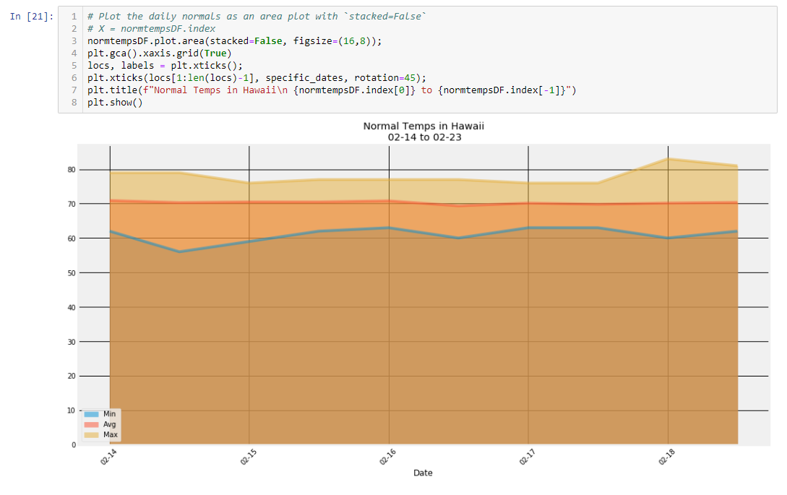
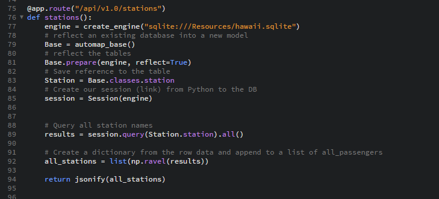

# ClimateAnalysis_Flask_App

## How perfect is the weather in Hawaii?
### Using sqlite file loaded with precipitation and temperature readings from numerous weather stations throughout the state, that's exactly what this notebook is trying to find out!

* Jupyter Notebook exploring the data and visualzing with matplotlib

* Flask-SqlAlchemy App with API endpoints

